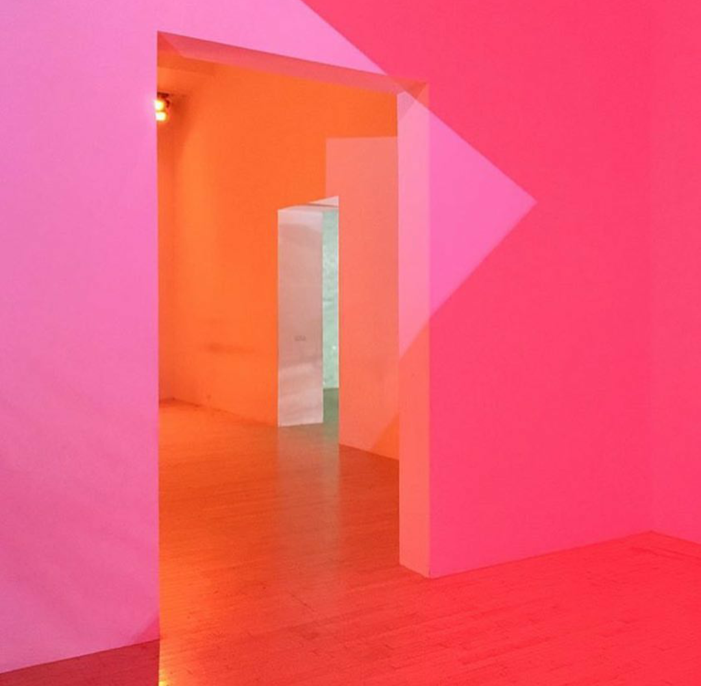

### **Bio:**
   “Never, ever, ever give up.” – Michael Scott
   
   I am excited to learn more about designing mobile user interfaces and getting more experienced with GitHub.
   I enjoy being in nature and traveling. I like exploring botanical gardens and propagating my own little cactus plant collection at home.    My favorite tv show is The Office (origin of my motto choice).
   
   -------

### **List Of Portfolio Projects:**

1. [Media Queries](https://bridgetmarie-git.github.io)
2. [Skeleton](https://bridgetmarie-git.github.io/Resume/index.html) 
3. [Flexbox](https://bridgetmarie-git.github.io/Flexbox/index.html)
4. Bootstrap

 
